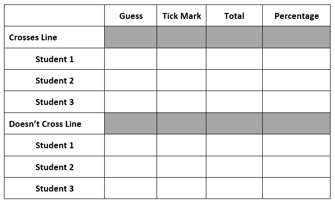

# Buffon's Needle

## Introduction

This session will take more organization by the facilitator to help students find interesting results, find instructions as follows:

First, divide the class into groups. Have each group draw the following table on a sheet of paper: Also give each group the striped sheet shown below and a toothpick (students might want to colour their toothpick to make it easy to see which is theirs).

Each student should enter their guess as to the percentage of times a toothpick dropped on the striped sheet will cross a line. Then have each student drop the matchstick on the striped sheet ten times. They should record a tally in the Tally column for picks that cross and do not cross the line. Calculate totals and the overall percentage, ask learners to compare to their predictions.
Next compute a total and percentages for each group of students and enter the numbers in the shaded cells. Finally, compute a total and percentages for the entire class. Measure the length of the matchsticks and compute2L/XP , where L is the length of the matchstick in mm, X is the width of the stripes in mm, and P is the Doesn’t Cross Line percentage. What do you notice?

## Solution

The answer should become closer to Pi π as you repeat the experiment more and more times!

## Extension

Students can repeat the experiement more times or try with different length picks.
