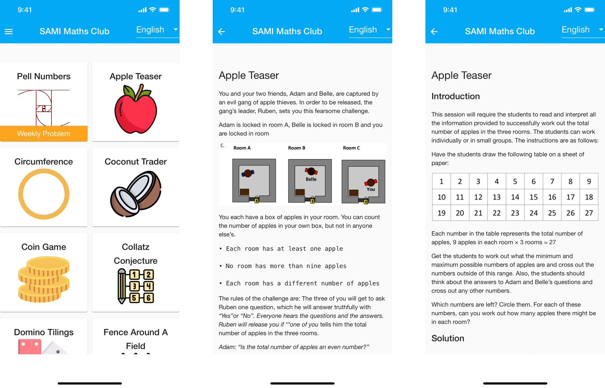

# SAMI Maths Club

This repo contains source code for the SAMI Maths Club App

Download for Android from [Google Play](https://play.google.com/store/apps/details?id=io.c2dev.samimathsclub),
iOS on [App Store](https://apps.apple.com/app/sami-maths-club/id1527293312),
or [Use Online](http://mathsclub.samicharity.co.uk/)

# Get Involved

## Contributing Problems

Have a favourite maths puzzle or problem?

See the [Authors Documentation](./documentation/authors.md) for ways to include it in pack.

## Contributing Translations

Want to translate problems into more languages?

See the [Translators Documentation](./documentation/translators.md) to learn how to join our translations project.

## App Development

See the [Developer Documentation](./maths-club-app/README.md) for more information about running locally or on android.
