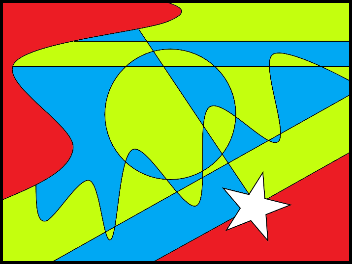

# Colouring Maps

## Introduction

This seemingly simple problem manages to disguise some very nice mathematics related to the field of graph theory.

Students may design their own maps or use the one given in the question, they should not need more than four colours to fill their map, although they will not know this initially (see Extension section for proof).

## Solution

For the map given in the question, we can show that the map can be coloured using four colours. In fact, we will se that it cannot be done in any fewer.

The majority of the map can be coloured using just two colours, take blue and green:

At this point, we wish to colour the region in the top left corner. Since it shares edges with both blue and green regions, we must introduce a third colour, say red. This is also true for the region in the bottom right corner.

Now we want to colour the star-shaped region. However, the star shares edges will a blue, a green and a red region so we must introduce a fourth colour. Yellow seems appropriate.

And so, we have coloured this map using exactly four colours. Clearly, we could have used more colours (we could, for example, use a different colour for each of the 29 section). But, having seen that we were required to introduce four different colours, we could not have used less.

## Extension

We can ask the question, is there a smallest number of colours which will be able to colour in any given map? The answer is yes, and it is 4. Students may notice this pattern from trying lots of different maps, however showing it conclusively requires us to use graph theory.

Specifically, we are going to translate the maps into mathematical *graphs* (likely not the type of
graph that you are used to). To do this we will:
- Replace the different regions on the map with circles
- Connect up the circles representing regions which share edges using lines. 

(We usually refer to these circles as *vertices*, and the lines as *edges*. This is somewhat confusing, but "edges" is used with two different meanings in this question. It can refer to the boundaries of a region, or a connection between vertices.)

Let us take a portion of the example map and turn it into a graph. For the part in the bottom-right corner:

Notice how our previous rule, that regions which share an edge cannot be the same colour, is maintained in the graph as no two connected vertices can be of the same colour.

Also notice that the graph does not have any intersecting edges. In fact, any graph which represents a valid map can be drawn without any edges intersecting.

Knowing these two things will allow us to prove that we can always colour a map using four colours or less. Let us try to contrsuct a graph which needs a minimum of five colours to fill. To do this, we need to contruct a graph of five vertices where each is connected to all the others and none of the edges cross.

From the example map, we can make a graphy with four vertices where all are connected to each other and none of the lines intersect:

If we now try to add a fifth vertex, there are 4 areas where we could try to do so:
- In any of the three small triangles formed by connecting the Yellow vertex with two others. 
- Outside the large trianle formed by the Red, Green and Blue vertices.

However, in each case, we can only connect up the additional vertex to three others without any edges crossing. This means that they do not, in fact, have to take a new colour and we can still colour the graph with four colours.

So, we have shown that we cannot construct a graph requiring five different colours to fill.

Equivalently, we cannot draw a map which needs different five colours to fill. We can fill any map with a maximum of different four colours.
