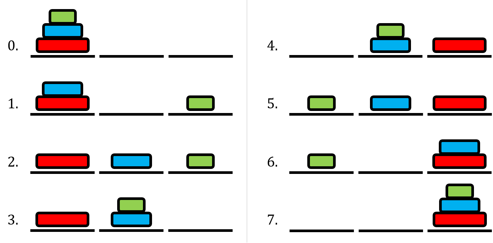
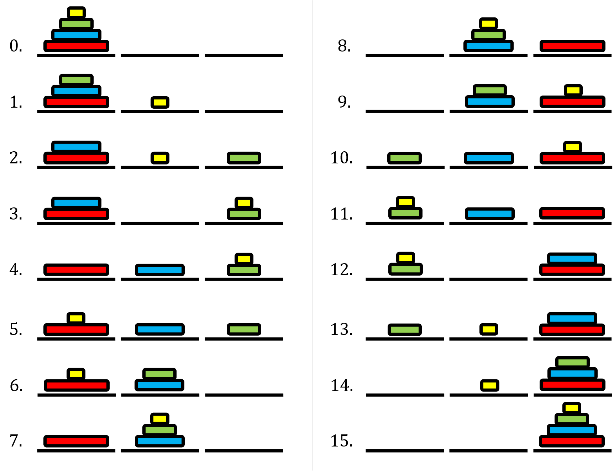
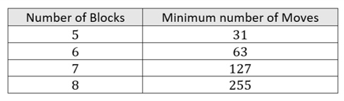

# Tower of Hanoi

## Introduction

This game is a classic recreational maths puzzle. It is, in fact, possible to move the tower abiding by the rules for any number of blocks (see Extension section).

For students to try out the problem, stacked blocks are likely the most readily available objects. Often, the problem is shown using three pegs and different sized disks with holes in the middle which can be slid over the pegs. Alternatively, the puzzle can be drawn out at each stage to represent the moves made (as in the Solution section).

## Solution

For three blocks, the tower can be moved to the rightmost platform in a minimum of 7 moves. The process is as follows:

Notice how, after the fourth move, we make very similar moves to 1, 2 and 3 but in reverse order and reflected horizontally. So, instead of dismantling a tower on the left (as in 1, 2 and 3), we are rebuilding the tower on the right.

Using this may help you to work out how to move a tower of four or more blocks.

## Extension

For four blocks, the tower can be moved to the rightmost platform in a minimum of 15 moves:

You may notice a pattern emerging. If we continue adding more blocks, the minimum number of
moves required is as follows:

You may notice that for some number of blocks $n$, if the minimum number of moves is $m$. Then the
minimum number of moves for $n + 1$ blocks is $2m + 1$.  
ie. $15 = 2 \times 7 + 1$, $31 = 2 \times 15 + 1$, etc.

Thinking about why this is, in the case of four blocks:  
- The first stage is to move the top three blocks to the central position, which takes 7 moves.
- Next, the largest block is moved to the rightmost position, taking 1 move.
- Finally, the top three blocks are moved from the central position to the rightmost position, taking 7 moves.

So overall this takes $7 + 1 + 7 = 2 × 7 + 1 = 15$ moves.

Generally, in the case of $n + 1$ blocks:
- The first stage is to move the top $n$ blocks to the central position, which takes $m$ moves.
- Next, the largest block is moved to the rightmost position, taking 1 move.
- Finally, the top $n$ blocks are moved from the central position to the rightmost position, taking $m$ moves.

So overall this takes $m + 1 + m = 2m + 1$ moves
