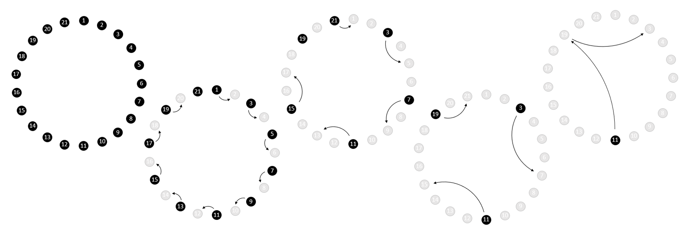

# The Josephus Problem

## Introduction

The Josephus Problem comes from an account by the first century historian and soldier Flavius Josephus, where he narrates his capture by Roman soldiers. To read about the origins of this story, you can view the... <link>

The problem can be generalised with different numbers of people in the circle, a nice activity is to play out the game with a class of students.

## Solution

For 21 people the ‘winning’ position is 11. This can be seen by working through the problem:

For different numbers of players, the winning position is as follows:

Students might notice a pattern, that the number of the winning position seems to increase through consecutive odd numbers, starting back at 1 at each power of 2. 

To show this pattern as a mathematical expression, we can work out the winning position from the number of players by subtracting the largest possible power of two and then multiplying by two and adding one. 

For example, for 21:

$21 - 2^4 = 5$  
$(2 \times 5) + 1 = 11$

See the extension section for why this relationship is true.

## Extension

Consider how the game evolves when the number of players is a power of two, say, in general $2^n$:

Player 1 declares Player 2 as out.  
Player 3 declares Player 4 as out.  
In general, every Player $2n − 1$ declares Player $2n$ as out.

So, when it is the first players turn again, all of the remaining players are the odd numbers. If we renumber all of the players 1, 2, 3, ... we are essentially playing a game with $2^(n-1)$ players
(if you need to convince yourself of this, try drawing out a game with 16 players). 

So, a game with $2^n$ player will have the same winner as a game with $2^(n-1)$ players.

Continuing with this argument, we can say that that any game with $2^(n-1)$ players will have the same winner as a game with $2^(n-2)$ players, and so on until we show that the winner will be the same as a game with just two players. Since the first player will win a game with two players, we can see that the first player will win any game where the number of players is a power of two. This conclusion is supported by the examples in the Solution section.

Now, thinking about a general game, we can begin getting players out until the number of players left is a power of two. For example, in a game with 21 players:

Player 1 declares Player 2 as out.
Player 3 declares Player 4 as out.
Player 5 declares Player 6 as out.
Player 7 declares Player 8 as out.
Player 9 declares Player 10 as out.

At this point, there are 16 ($2^4$) players left and since player 11 has the next move we know that they will be the winner (we saw previously that in a game with $2^n$ players, the player taking
the first turn will win).

So, for a general game:
- We subtract the highest power of two possible from the number of players, after this many turns the number of players remaining will be a power of two.
- At this point, if $k$ is the difference between the number of players and the highest power of two, it will be the turn of Player $2k + 1$ (or the $(k + 1)$th odd number).

This explains the pattern we noticed in the Solution section.
