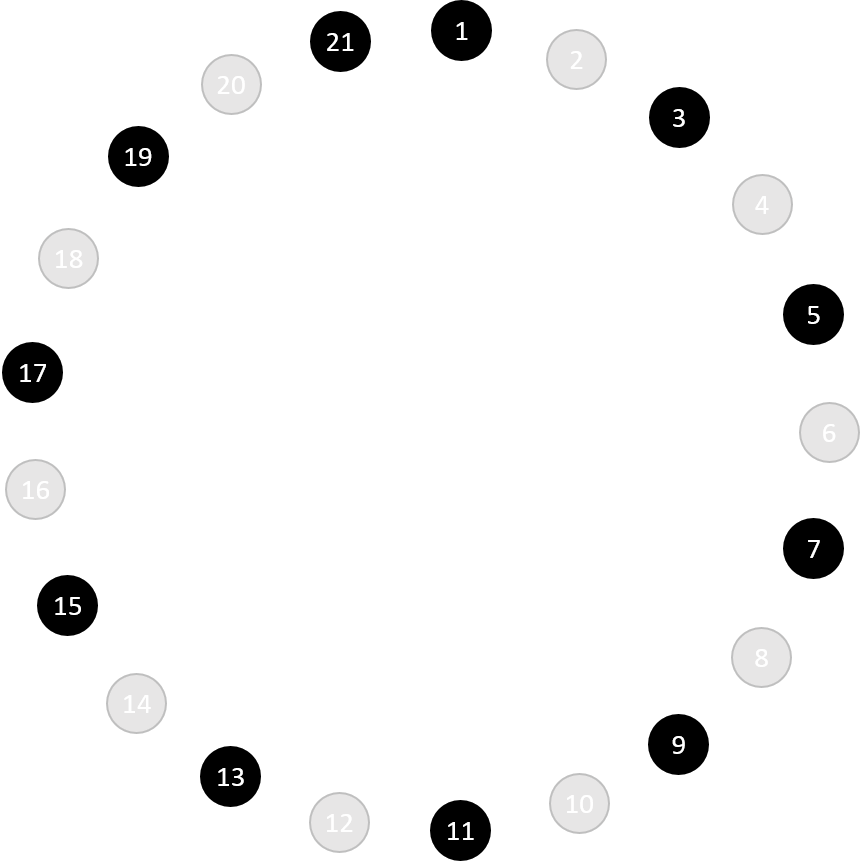

# The Josephus Problem

You and 20 other people are standing in a circle to play a game:

Starting with the first person, each player still in the game declares the next person still in to the left of them as ‘out’. So player 1 declares player 2 out, player 3 declares player 4 out and so on.

After player 19 declares player 20 as out, player 21 will declare player 1 as out and then player 3 will declare player 5 out. This continues until just one player remains.

Can you work out the number of the last player remaining?

What about for different numbers of players, can you find a way to predict which player will be left?
