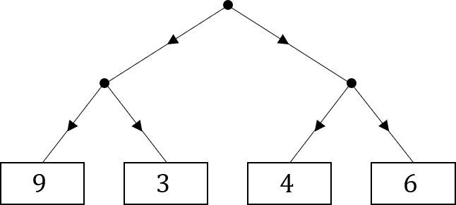

# MiniMax Algorithm

Here is a *map* for a game:

Starting at the top point, you can choose to move down the map either to the left or the right. From here, your opponent then chooses to move down left or right to one of the numbers.  
How should you play if:  
a. You want to end on the highest number possible and your opponent wants to end on the smallest number possible?  
b. You want to end on the smallest number possible and your opponent want to end on the largest number possible?

Here is another map:

Again starting at the top, you and your opponent take turns to move either left or right down the map, you get the first move. Starting at 0, add or subtract each number that you or you opponent lands on for a combined total. You should try to score the highest total possible, and your opponent will try to score the lowest.

Assuming you and your opponent both play optimally, what route will be taken and what will the final score be?
