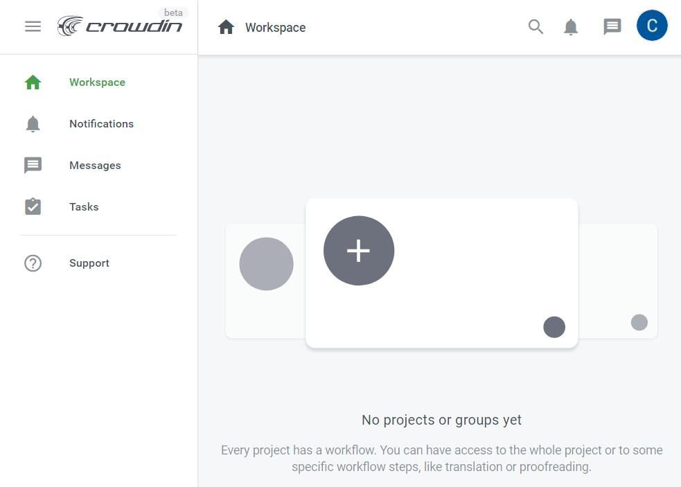
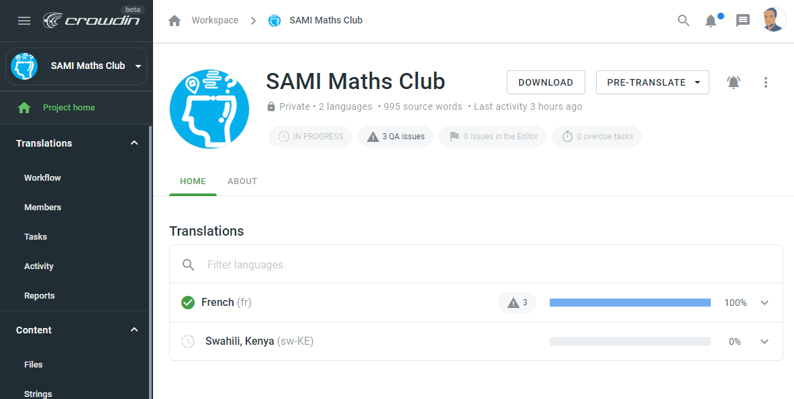
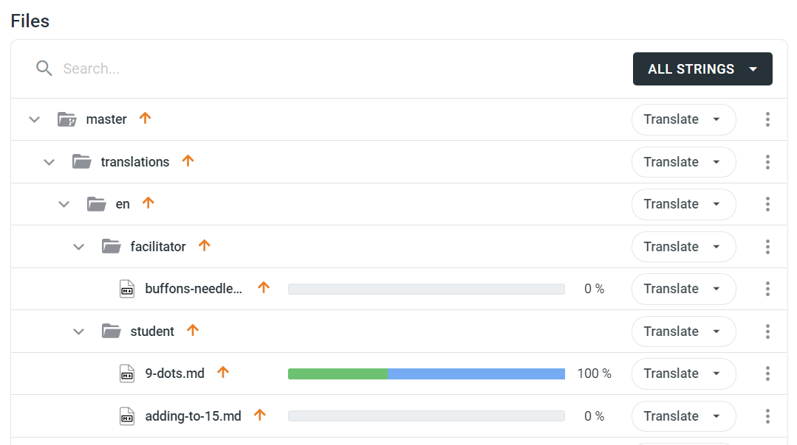
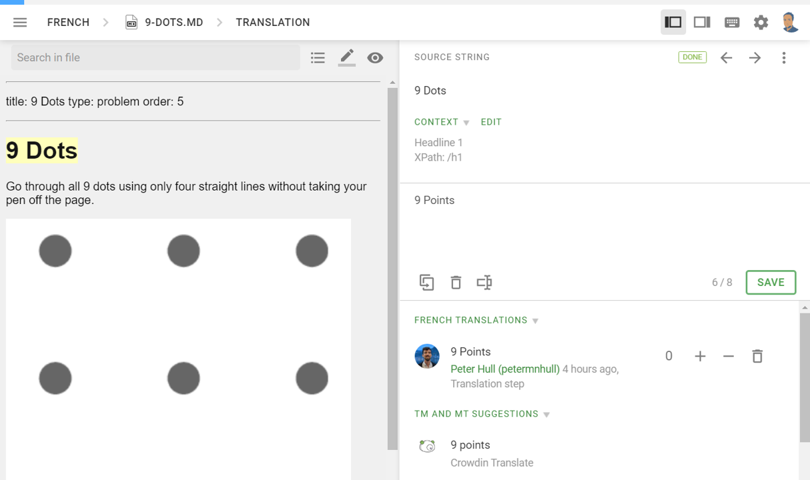
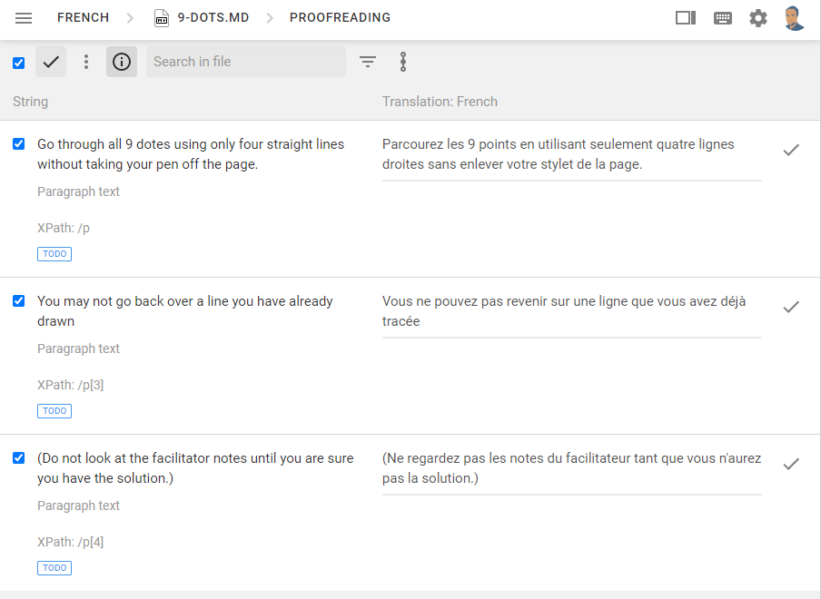
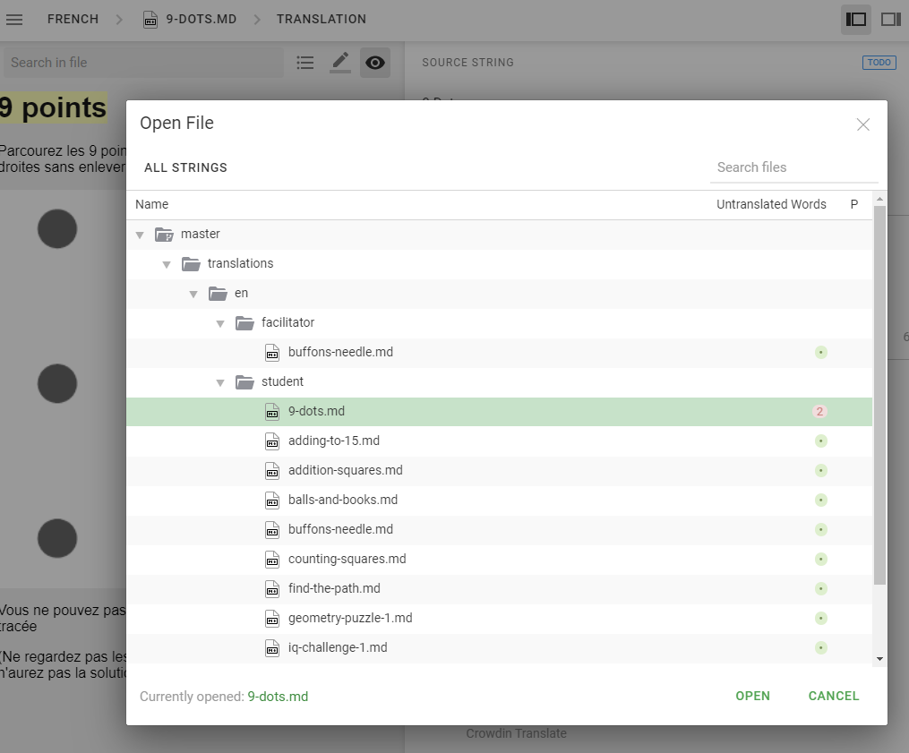

# Translators Documentation

## Joining the Project

All translations are managed online via a system called crowdin. You can join the project by clicking on the direct link: https://sami.crowdin.com

Once joined, you will still need an invite to the maths club project. Email [admin@supportingami.org](mailto:admin@supportingami.org?subject=SAMI%20Maths%20Club%20Translations) to request an invite

## Project Home Page

Here you will see a list of languages and current translation status.

There are two bars, a blue one showing submitted translations and a green one showing approved translations.

Clicking on a language gives a full breakdown by problem

Clicking on a row will load the editor

## Translation Editor Page

Text for translation is highlighted in yellow. You can see the current translation in the box on the right, alongside other possible recommendations. Make required changes to the translation and click save.

**Note** you can ignore any text at the very top (title:... type:... order:...), this is just additional data used in the app.

Click the view toggle icon to see the problem as currently translated.

## Proofreading Page

All translations also require proofreading. Anybody can proofread, although it is best if this is somebody other than the original translator. The job of the proofreader is to check all text is translated correctly, and in case of any conflict from multiple translations decide which version to keep.

You can toggle this screen from the menu bar breadcrumbs.

## Loading More Files

Once translation has been complete for a problem different problems can be loaded from the menu bar breadcrumbs.

