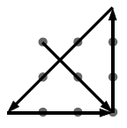

# 9 Dots

## Introduction

This problem is quite difficult and usually takes people a long time to solve. You have to think a bit differently to get the solution. Whether you find the solution or not, is not important. What's important is the thinking process you go through trying to solve the problem.

Often in school maths, you know what to do as soon as you see the problem. Here, you are faced with something new and the only thing you can do is try and make guesses. Then, you can improve on your guesses and try something different. Making many incorrect attempts is a good thing because you can understand why they don't work and improve on them.

We have included the solution here just as a check. But there is no value in just looking at the answer without trying to solve the problem first. The satisfaction of solving the puzzle on your own is much greater than someone telling you the solution.

## Solution

The secret here is to pay close attention to what is and what is not stated in the question. There is nothing to stop your line extending outside of the shape like so:

## Extension

You could try find the minimum number of lines it takes to draw through a 4 x 4 dotted grid
