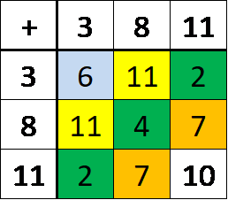
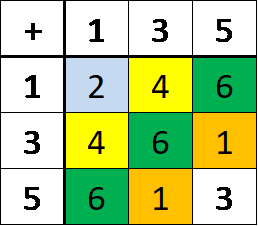

# Addition Squares

## Introduction

The secret to this problem relies on the fact that different base number systems can be used in mathematics. Consider how when we record time, the next minute after 10:59 is 11:00. Minutes count up till 60 before we restart from 0. We call this modular arithmetic, in the case of time we operate with modulo 60.

## Solution

The missing number is 10. This is an addition square modulo 12. This means that after doing the normal addition we take away as many multiples of 12 as we can before the number is less than 12.
So 11 + 11 = 22 and when we take away 12 we get 10.
Try it for the other additions to see that they follow this rule.

The second square is doing addition modulo 7. So the missing number is 10 because 5 + 5 = 10 and when we take away 7 from 10 we get 3.

## Extension

Where do we use this type of mathematics in the real world? Can you create your own puzzles using modular arithmetic?
