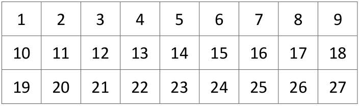
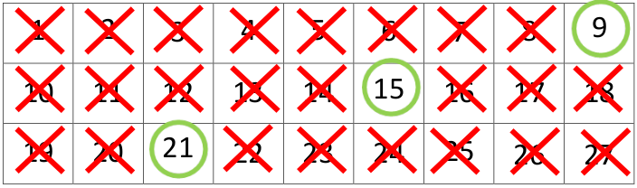
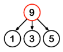
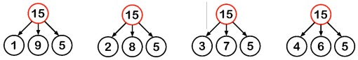
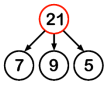

# Apple Teaser

## Introduction  

This session will require the students to read and interpret all the information provided to successfully
work out the total number of apples in the three rooms. The students can work individually or in small
groups. The instructions are as follows:  

Have the students draw the following table on a sheet of paper:  

  

Each number in the table represents the total number of apples, 9 apples in each room × 3 rooms = 27  

Get the students to work out what the minimum and maximum possible numbers of apples are and cross out the numbers outside of this range. Also, the students should think about the answers to Adam and Belle’s questions and cross out any other numbers.  

Which numbers are left? Circle them. For each of these numbers, can you work out how many apples there might be in each room?

## Solution  

Working out the minimum number of apples: We know that there is at least one apple in each room and each room has a different number of apples. So, the minimum number of apples is 1 + 2 + 3 = 6. Cross out numbers 1, 2, 3, 4, 5.  

Working out the maximum number of apples: We also know that no room has more than nine apples, so the maximum number of apples is   7 + 8 + 9 = 24. Cross out numbers 25, 26, 27.  

From the questions, we know that the total number of apples is not an even number and it is not a prime number. So, cross out the even numbers and prime numbers.  

Circle the numbers that remain.  

   

Case 1:  If the total number of apples is 9 and you have 5 of them in your room, then Adam and Belle have 4 apples between them. So, one has a single apple and the other has 3 apples.   

Case 2: If the total number of apples is 15 and you have 5 of them in your room, then Adam and Belle have 10 apples between them. Here, there are many possible combinations:   

  

Case 3: If the total number of apples is 21 and you have 5 of them in your room, then Adam and
Belle have 16 apples between them. So, one has 9 apples and the other has 7 apples.  

  

**So, what is the question you should ask?**  

You should ask:  *“Is the total number of apples 15?”* and reconsider each case.  

Case 1: The total number of apples is 9: then the person who has the single apple knows that the
total cannot be greater than 1 + 8 + 9 = 18 and the person who has 3 apples knows that
the total cannot be greater than 3 + 8 + 9 = 20. Either Adam or Belle should tell Ruben
that the answer is 9.  

Case 2: The total number of apples is 15: then Ruben will answer “Yes” and any one of you can tell
him that the answer is 15.  

Case 3: The total number of apples is 21: then the person who has 9 apples knows that the total cannot be less than 9 + 1 + 2 = 12 and the person who has 7 apples knows that the total cannot be less than 7 + 1 + 2 = 10. Either Adam or Belle should tell Ruben that the answer is 21.
 

