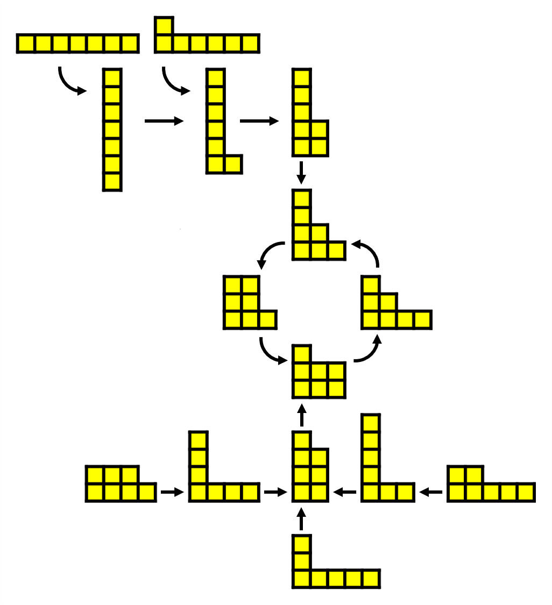
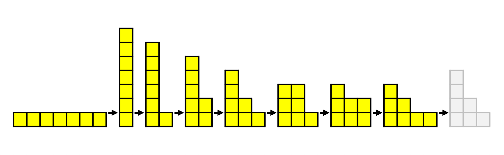
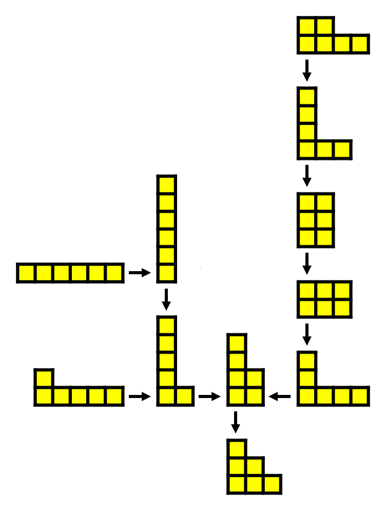
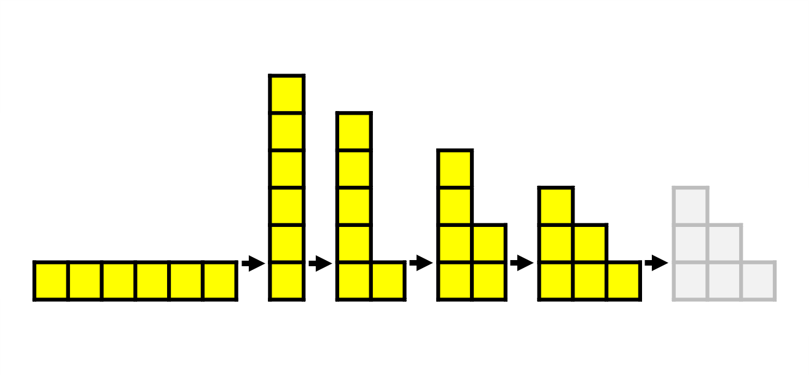
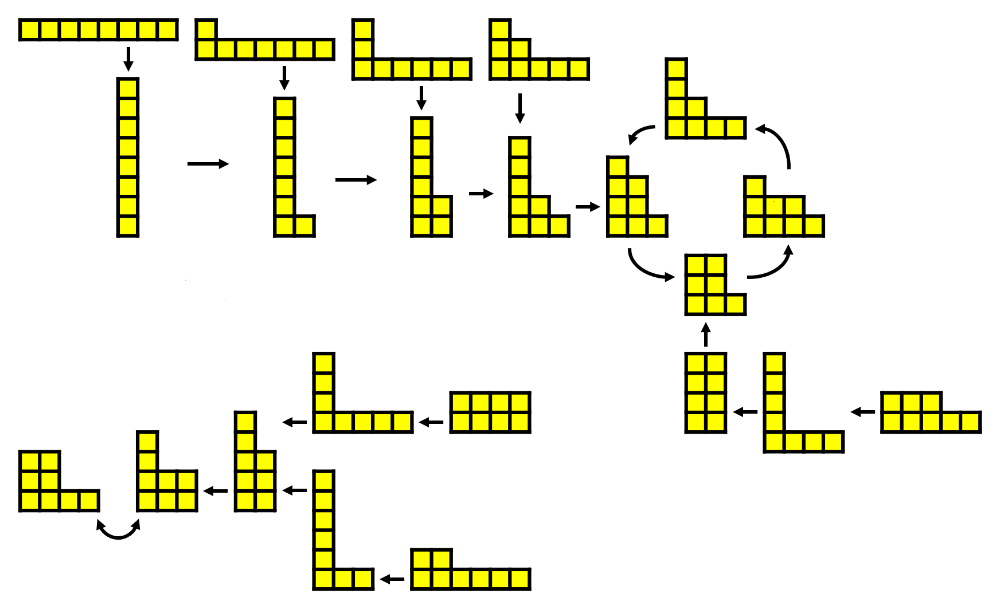
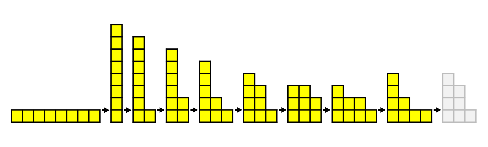

# Bulgarian Solitaire

## Introduction

In this question we are using an *algorithm*, which is a simply set of intructions, to generate a sequence. Algorithms are used all over mathematical and computer sciences so it is good for students to be familiar with the idea. The nice part about this puzzle is that there are many questions that you could ask about the algorithm which is presented:

How many possible cities are there for some number of blocks?  
What is the longest sequece for a given number of squares?  
How does a sequence using some number of squares end?

Students can (and should) ask their own questions about this puzzle and others as this is a very important skill in mathematics.

## Solution

Here we will discuss the puzzle using 7 blocks, you can see the extension section for 6 and 8 blocks as well as some links to resources regarding this puzzle.

Let us write and arragement of piles by listing the number of blocks in each pile from left to right.  
In this way we can write the starting city in the example as **(5,2)**.  
The sequence in the example can be written **(5,2)** $\rightarrow$ **(4,2,1)** $\rightarrow$ **(3,3,1)** $\rightarrow$ **(3,2,2)** $\rightarrow$ **(3,2,1,1)** $\rightarrow$ *(4,2,1)*

There are 15 options for an arrangement of 7 blocks:  
**(7)**  
**(6,1)**  
**(5,2)**, **(5,1,1)**  
**(4,3)**, **(4,2,1)**, **(4,1,1,1)**  
**(3,3,1)**, **(3,2,2)**, **(3,2,1,1)**, **(3,1,1,1,1)**  
**(2,2,2,1)**, **(2,2,1,1,1)**, **(2,1,1,1,1,1)**  
**(1,1,1,1,1,1,1)**  

We can start to join up these arrangements based on which lead to which when they are rearranged. For example,  
**(7)** $\rightarrow$ **(6,1)**  
**(6,1)** $\rightarrow$ **(5,2)**  
**(5,2)** $\rightarrow$ **(4,2,1)**  
**(5,1,1)** $\rightarrow$ **(4,3)**

In fact, we can create a flow diagram which joins up all of the different arrangements made up of seven squares:

Now we can see the answers to our questions. The longest sequence has 7 different arrangements, starting at **(1,1,1,1,1,1,1)**:

And we can also see that all of the sequences end in a loop of four arrangements: **(4,2,1)**, **(3,3,1)**, **(3,2,2)** and **(3,2,1,1)**.

## Extension

Using 6 blocks, there are 11 different possible arrangements:  
**(6)**  
**(5,1)**  
**(4,2)**, **(4,1,1)**  
**(3,3)**, **(3,2,1)**, **(3,1,1,1)**  
**(2,2,2)**, **(2,2,1,1)**, **(2,1,1,1,1)**  
**(1,1,1,1,1,1)**  

We can arrange these in a flow diagram:

So the longest sequence has 7 different arrangements, starting at **(2,2,1,1)**:

And all sequences end in the arrangemesnt **(3,2,1)**, which produces itself then rearraged.

Using 8 squares, there are 22 different possible arrangements:  
**(8)**  
**(7,1)**  
**(6,2)**, **(6,1,1)**  
**(5,3)**, **(5,2,1)**, **(5,1,1,1)**  
**(4,4)**, **(4,3,1)**, **(4,2,2)**, **(4,2,1,1)**, **(4,1,1,1,1)**  
**(3,3,2)**, **(3,3,1,1)**, **(3,2,2,1)**, **(3,2,1,1,1)**, **(3,1,1,1,1,1)**
**(2,2,2,2)**, **(2,2,2,1,1)**, **(2,2,1,1,1,1)**, **(2,1,1,1,1,1,1)**  
**(1,1,1,1,1,1,1,1)**

We can arrange these in a flow diagram:

But here we notice a difference from using 6 or 7 blocks. The flow diagram is in two seperate parts!

We can still identify the longest sequence, which starts at **(1,1,1,1,1,1,1,1)** and has 9 different arrangements:

Depending on the starting point, we can either end up at:  
a 4 arrangement loop: **(4,3,1)**, **(3,3,2)**, **(3,2,2,1)** and **(4,2,1,1)**  
a 2 arrangement loop: **(3,3,1,1)** and **(4,2,2)**  
(Have a look at the video link below to see why this is!)

If you would like to explore the ideas of this puzzle further, here are some excellent resources:

[MathPickle](https://mathpickle.com/project/bulgarian-solitaire-patterns/)  
A slide show which gives flow diagrams and ending loops for cities using large numbers of squares.  
[Tipping Point Math](https://www.youtube.com/watch?v=p3Bzvlnl-1s)  
A YouTube video which looks at why certain numbers of squares give one or multiple ending loops of certain sizes.
