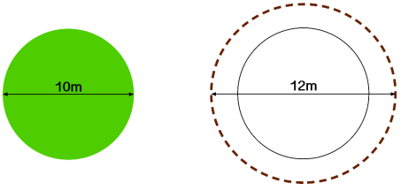
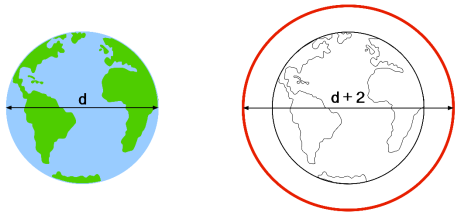
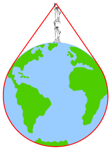

# Circumference

## Introduction  

The answers to the two questions are related and can be done in any order. Question 1 uses numerical values to calculate the circumference but question 2 requires students to leave the width as a constant d.  

These puzzles are interesting because the result is not immediately obvious. It will get students thinking about how their answers apply to different circles, regardless of their size. Encourage group discussions about the answers that they found. Students can leave their answers in terms of π or use the approximation π ≈ 3.  

Circumference of a circle = diameter × π

## Solution  

<ins>Question 1 </ins> 

Firstly, you need to work out how much fencing was needed **before** the extension. To do this, students will need to calculate the circumference of the original field = width × π = 10π  

Secondly, you need to work out how much fencing will be needed  **after**  the extension. The width of the bigger field is now 1 + 10 + 1 = 12. Then the circumference of the bigger field = width × π = 12π  

  

The amount of fencing the farmer would need is the difference between the two circumferences worked out above. The farmer would need 12π − 10π = 2π more fencing. This is approximately ≈ 2 × 3 = 6 metres.  

<ins>Question 2 </ins>

The method is the exact same as for question 1 except here you leave the width as a constant d.  

Firstly, you need to work out how much rope was needed when it was tied around the equator of the earth. To do this, students need to calculate the circumference of the earth = width × π = dπ  

Secondly, you need to work out how much rope will be needed if we instead want the rope to be 1 metre above the earth at all points. The width of the bigger circle is now 1 + d + 1 = d + 2. Then the circumference of the bigger circle = width × π = (d + 2) × π = dπ + 2π.  

  

Like how this was worked out in question 1, the amount of extra rope needed is the difference between the circumference of the earth, dπ, and the circumference of the bigger circle, dπ + 2π. Amount of rope = (dπ + 2π) − dπ = 2π.  

**What do you notice about the answers to question 1 and question 2? What would happen if you did the same with a smaller planet? Why do you think this happens?**  

## Extension

**Extension – something to think about, not work out!**   
   
What is even more interesting is what happens when the rope is lifted by a single point. The rope around the bottom of the earth is taut but now there is a large clearance at the top. For an additional 2 metres length of rope, the distance from the earth’s surface to the peak of the rope would be enough to fit **two Statue of Liberty’s underneath it!**  

Are you surprised that such a small increase in the length of the rope will reach such a large height? Think about how this height would change when you change the size of the ball.

