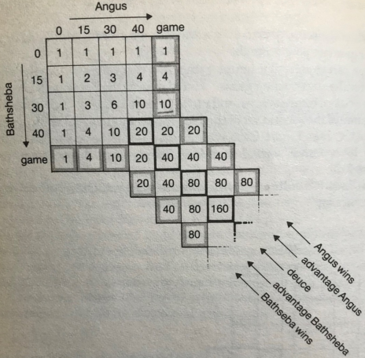

# Coin Game 

## Introduction

This simple coin game serves as an introduction to probabilities in tennis. It is really worth playing the game first with the students before trying to answer the questions to ensure everyone understands the way the game works particularly when to stop playing.  

Go through the answers to the first two questions before students try to fill in the table.  

Watch students closely when they start filling in the table to ensure they are on the right track and help as necessary.  

## Solution

*Which of the following scores are impossible in this game and why? 5-2, 7-4, 6-2,*  

5-2 is possible.  

7-4 is impossible because that would be 11 tosses and you are only allowed 11.  

6-2 is impossible because the game would have stopped before it got to this stage. Player 1 would have already won some time before.  

*Think of ways the game could end in a tie* - Either 5-5, 6-4 or 4-6  

*What is the chance of winning this game?* 

The easiest way to fill in the table is to start in the top left corner, and each square is the sum of the number immediately to the left and immediately above. E.g. The numbers

    

It is tempting to add up the number of ways to win (1+3+9+27) and divide by the total of all the numbers in the table. But this would be wrong. It is wrong because the game lengths are different in each case.  

The 1 in the blue outlined box represents a game of length 3, getting three heads in a row – the chance of which is $\frac{1}{2}$× $\frac{1}{2}$ ×$\frac{1}{2}$.    

The 3 is for a game where there was 4 heads and 1 tail. One way of this happening is THHHH. The
probability of this is $\frac{1}{2}$× $\frac{1}{2}$ ×$\frac{1}{2}$ × $\frac{1}{2}$  . Then there are the other two ways of HTHHH or HHTHH (note that
HHHHT is not an option because the game would have stopped at 3-0). Therefore the probability of winning in this way is 3 × ($\frac{1}{2}$ )$^ 5$
etc.    

Therefore the probability of winning is 1 × ($\frac{1}{2}$) $^3$ + 3 × ($\frac{1}{2}$) $^5$ + 9 × ($\frac{1}{2}$) $^7$ + 27 × ($\frac{1}{2}$) $^9$ ≈ 0.3418  

## Extension

The way the scoring works in tennis is that you have to win by two clear points, so the same strategy as used above can be used to answer the question “If you have a one third chance of winning a point in tennis, what is your chance of winning a match?”  

Here is the working for just winning one game in tennis with players called Angus and
Bathsheba:  

The maths involves summing an
infinite series because tennis
games could technically go on
forever!    

 

