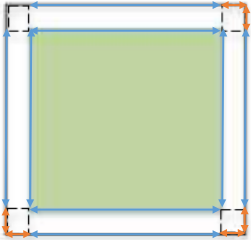

# Fence Around A Field

## Introduction

This problem probably appears more difficult than it is at first. Learners may wish to first try with an example using numbers for the length and width of the field, however this is not necessary to solve the problem. 

## Solution

This is a question about perimeter. The key to a quick and easy solution here is to understand that the edges of the fence parallel to the edges of the field will always be the same WHATEVER THE SIZE OF THE FIELD. 
The extra fence is only needed at the corners (shown in the diagram).
In total there will be 8 extra pieces, all measuring the same length, perhaps called w. 

We know that the extra length of fence is 1 metre which is the total length of the 8 pieces. 
Therefore if 8w = 1m, w = 12.5 centimetres. The path is too narrow for a tractor but a mouse could easily run along it.

## Extension
This problem sets up nicely for another called the belt around the earth, which goes as follows:
Imagine a piece of rope is tied the entire way around the earth, along the equator, so that it fits perfectly. If we instead wanted the rope to sit 1 metre above the earth at all points, how much longer does the rope have to be?

Hint: you do not need to know the size of the earth! 

