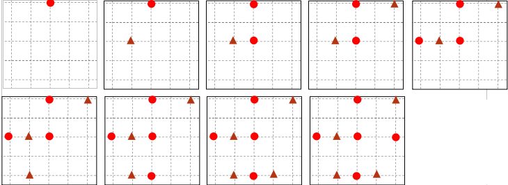
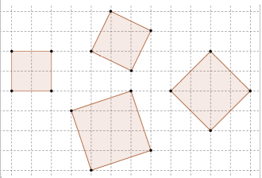

# Making squares

## Introduction

This game is a great way to practice using coordinates and develop geometrical reasoning (understanding of shapes). It might be a good idea to play the game once altogether, splitting the class into two teams. Each team takes it in turns to mark a point on the game grid until one team can join four of their own points together and make a square. A typical game on a smaller grid might look like:

## Solution

There are lots of strategies that teams can use, winning teams are most likely to be those who can visualize squares which have been rotated also. 
Part of the challenge of the game will be to convince all the other players that you have identified a correct square 
Learners may need to think about the properties of squares to prove it when they think they have won.

## Extension

If using coordinates you could tell students they must call out the coordinate correctly before marking the point. You could also try using other shapes such as parallelograms, or holding a small contest with students playing in pairs. 
