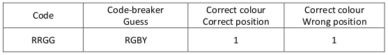
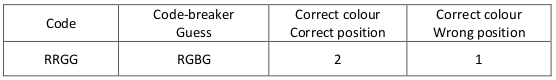
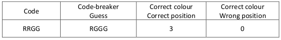
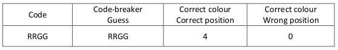

# Mastermind

## Introduction

This game tests logic and reasoning skills. Students will first guess the code at random, but should be able to develop strategies to help them guess in a faster time. An example of how the game might work to crack the code RRGG using a good strategy is outlined below:

   

The player now knows that there are only 2 different colours used in the code because otherwise they would have
more *‘correct colour wrong position’*. Using this they might guess:

   

The only letter that changed was Y->G in position 4. There is another colour in *‘correct colour correct position’*,
therefore the G must belong in position 4. The next guess is:   

    

The next guess is:

   

The fifth guess is:

   

## Solution

One good strategy for beginners is to change only one colour or one position each time a guess is made. This is not
however the optimal strategy.

## Extension

Try increasing the number of colours and positions, be careful though as the game quickly becomes very
difficult.
