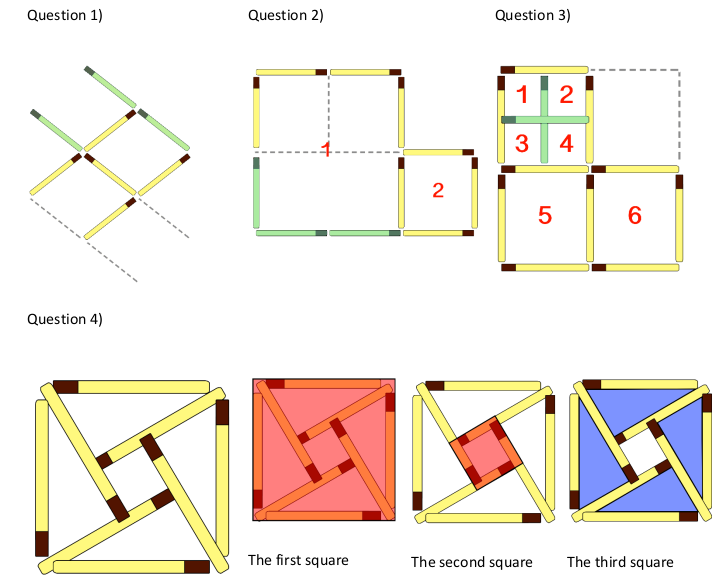

# Matchstick Puzzles

## Introduction    

This is an excellent activity to develop thinking skills. The four puzzles get more challenging and each require the students to think about how they can use the matchsticks in different ways. Don’t peek at the
solutions right away, give yourself time to figure them out!  

Students can approach this activity by drawing the matchsticks on some paper, or they can make the configurations with cocktail sticks or pencils laid out on the desk and try moving them around instead.

## Solution

