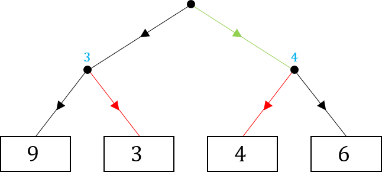
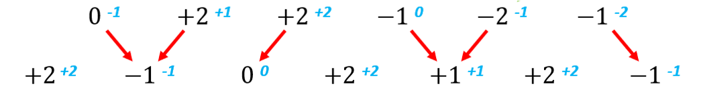
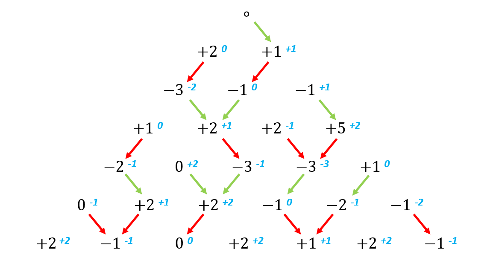
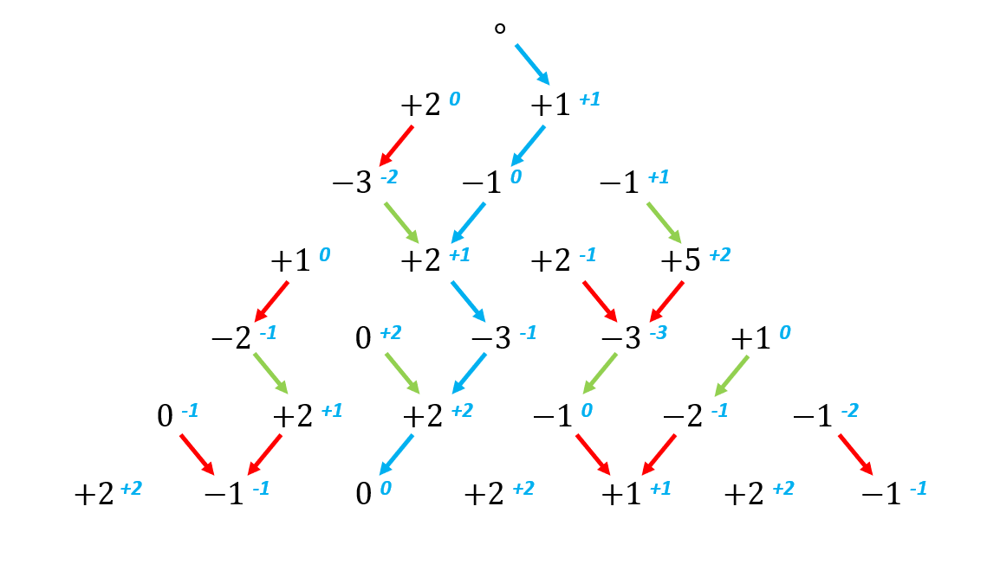

# MiniMax Algorithm

## Introduction

These games provide a introduction to the *MiniMax Algorithm*, an important tool in computer science and “game theory”. The MiniMax Algorithm is a method to work out the best way to act in order to minimise loses, or to achieve the *best outcome in a worstcase scenario* (like if our opponent plays optimally).

The first game is deliberately simpler, and hopefully students will be able to apply the same principles to a more complicated example in the second game (see Extension Section). 

## Solution

For the first game, say we are trying to achieve the highest score possible and our opponent the lowest (as in part a).

We know that our opponent will get the second move, and so they will choose the lowest of the two options available to them. As such, we can predict how they will move from each possible point.

So, if we move to the left, our opponent will move right to score 3. If we move right, our opponent will move left to score 4. This means that we will get a higher score from moving right, so that is what we should do.

This is despite the fact that, ideally, we would like to land on the 9, the highest result. However, since we know that our opponent is going to choose the lower of the two options, by moving right we *achieve the best outcome from the worst-case scenario*.

This process of working backwards, considering the result of being in each position, is how the MiniMax Algorithm works.

By the same logic, for part b, we should more right to obtain the lowest score possible. This way we will get a 6, whereas moving left we would get a 9.

## Extension

For the second game, there are many more possible routes through the map, making the situation more complicated. But by working backwards and applying the same logic, we can work out how to play optimally.

Starting by considering our opponents move on the second to bottom row, from which they will always choose the minimise the total by moving to the smaller of their two options:

- If they are moving from the 0, they will go right to the −1.
- If they are moving from the leftmost +2, they will go left to the −1.
- If they are moving from the rightmost +2, they will go left to the 0.
- If they are moving from the leftmost −1, they will move right to the +1.
- If they are moving from the −2, they will move left to the +1.
- If they are moving from the rightmost −1, they will move right to the −1.

So, when choosing our move from the third to bottom row, we must consider the total result of each direction including how our opponent will move subsequently (in blue below).

Wishing to achieve the highest total possible, we should choose to move to the largest total (blue number) possible from any position:

Notice how, from the 0, even though the choice is between two ‘+2’s the total achieved from each move is different. We should move right for a better overall score.

From this point, our opponent (playing optimally) will move from any point in the fourth to bottom row to minimise the total achieved. And we can continue this process of deduction upwards through each row:

And so, knowing how each player should move from any given position, we can deduce the route which the game will take if each player plays optimally:

Counter-intuitively, to score the highest total, we should move to the +1 on our first turn as opposed to the +2! This will allow us to get an overall total of +1, whereas by moving to the +2 the best we can get is 0.
