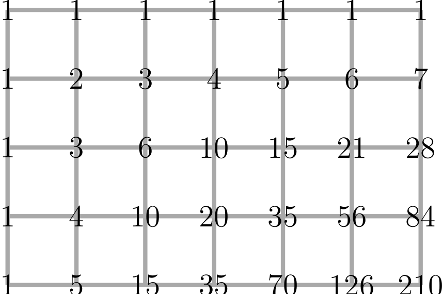

# Paths

## Introduction. 

This is a follow-up to “Balls and Books”. It is quite challenging as it introduces Pascal's triangle and using Pascal's triangle to solve other combinatorial problems. Students will very likely need some guidance (in the form of nudges and simpler intermediate tasks) to solve the first problem.

## Solution
1. Problem 1 might look scary at first. Trying to list all possible path will be hopeless, as we'll see there are too many. **Encourage the students to be systematic and solve smaller problems to points that are closer to A first!** A good task to **write, for each point on the grid, the number of paths to that point.** For some points this will be easy, for example for the points in the first row or first column there is only 1 path. For the points in the second row or column this is a little harder, but still possible. For a point in the second row, you can only go down once. If the point is in the third column for example, then there are 3 choices where to go down: Either in the first, second or third column. Thus, in the second row the numbers will be: 1, 2, 3, 4, 5, 6, 7.

From here on, it gets much harder. One question to lead onto the right track is: **Can you get the number of paths from A to B, if you already know the number of paths from A to all the points closer to B?** The key realization is that if you want to know the number of paths to a point X, and you know the number of paths for the point above X and for the point to the left of X, then the number of paths to X is simply the sum of  number of paths for the point above X and the number of paths for the point to the left of X! This way, it is easy to fill in the grid by simply adding up numbers. It will look like this. **From A to C there are 42 paths, from A to B there are 210 paths.**

2. Some students might have already solved problem 2 when trying the first problem. Considering one can only go Down and Right, the natural thing to do is simply writing down a sequence of R's and D's. The example path would be RDRRRDRRDD. Writing it down as numbers is slightly less straight-forward. One could write down the columns where the path goes down, however this will not help with solving the next problem. Instead, we can **write down only which path segments are going down.** In our example, the 2nd, 6th, 9th and 10th segment goes down, so we'd write 2, 6, 9, 10.

## Extension

**A)** If students have already done the “Balls and Books” problem you could ask to try and use the same methods to solve the problem of arranging 4 blue and 6 green books on a shelf
Note: Instead of using RDRRRD, you are now using book colours BGBBBG – see the similarity! The answer will be 210 again

**B)** Attempt the extension activity from “Balls and Books”, to calculate the number of ways of taking 3 balls out of a bag with 5 different colours. 
Note: If you numbered the balls you are considering how many ways there are of picking 3 numbers from 5 (e.g. 123, 145, 234 etc.). This looks very similar to the situation above if had 5 columns (representing the colours), and could take 3 down steps (picking a colour). The solution in this case will be 35!
