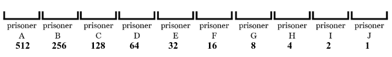
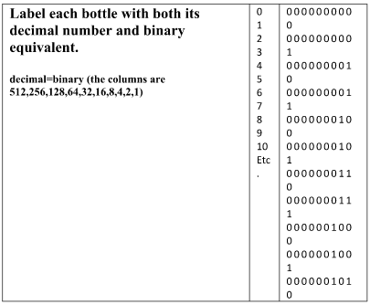

# Poisoned Wine Puzzle

## Introduction
This puzzle is interesting because it is possible to use only 10 prisoners to find the bottle. You could start by asking what the king could do if he had 1000 prisoners to help students understand the puzzle. You could number the prisoners 0 -999, number the bottles 0 -999 and the prisoners drink a drop from the bottle of wine with their number on it. After 24 hours, one of the prisoners will die, and their number is the bottle number.    

Then start to brainstorm ideas to do it with less prisoners.  

The answer to this puzzle is to use binary numbers, so it could be given to students who have already seen binary numbers, or it could be done at the same time as Magic Cards puzzle and Russian Multiplication and then binary numbers discussed at the end. 

## Solution

First, let’s line up our 10 prisoners and label them.  

 

Also label the wine bottles 0–999 so we can tell them apart.  

  
Now each bottle serves as a code describing which prisoners are to drink from it. In this system, a **one means the prisoner drinks** from it, a **zero means the prisoner doesn’t.**  

For example, bottle one should only be drunk by prisoner J since its binary is 0000000001. Whereas, Prisoners I and G should drink from bottle ten whose binary is 0000001010 because it has 1's in the columns that match up with prisoners I and G.  

Continue this process until you have given out sips of wine from every bottle. After 24 hours, line up the prisoners in order and note which ones have been poisoned with ones and mark the rest with zeros. Convert this number back into decimal to reveal which bottle was poisoned.
If prisoners A,B,C,F and I die, which bottle was it in?  (914)

## Extension

If there were 2000 bottles, how many prisoners would you need?