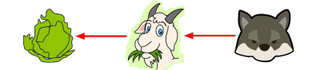
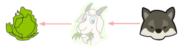
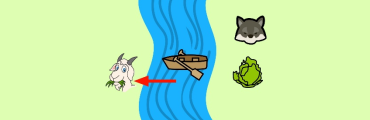
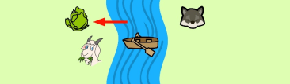
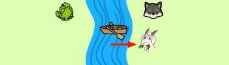
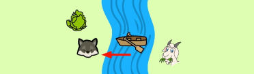
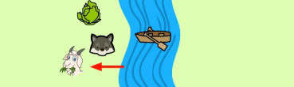
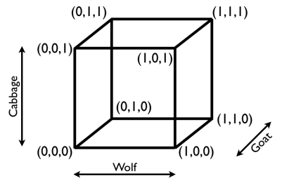

# River Crossing

## Introduction  

River crossing puzzles are challenging because it involves the students having to think logically about the order of movement and the rules on the river banks. The problem often requires students to use trial and error by playing out different scenarios until they either reach an endless loop, a dead-end or an acceptable solution.  

A fun way to solve this problem is to work in groups with each person pretending to be either the farmer,
the wolf, the goat or the cabbage. Students should draw a line on the floor that illustrates the river and then physically act out the problem by crossing the line.  

There is a more rigorous approach to this problem that will be introduced in the extension.

## Solution  

All solutions will start with moving the goat first. Can you think why this is the case? It is because the wolf eats the goat and the goat eats the cabbage, shown by the red arrows below:  

  

We need to break this chain. Removing one of the three objects needs to leave the remaining two objects with no arrows between them, that way nothing will get eaten when they are left on their own.  

Therefore, the first move will always be to move the goat to the other side.  

There are two possible solutions to this puzzle and they are explained below:  

<ins>Solution 1<Ins>  

At the start the wolf, the goat and the cabbage are all together with the farmer. As we discussed above, the farmer must take the goat to the other side first and then he travels back alone.   

  

Would you now move the wolf or the cabbage? In this case the farmer will take the cabbage to the other
side.  

  
But now the goat and the cabbage are on the same side and cannot be left alone because the goat will eat the cabbage. So, the farmer must take either the goat or the cabbage back with him.If he chose to take the cabbage back with him then the farmer would end up in an endless loop of moving the cabbage. So, he has no choice but to take the goat back with him. 

 

The goat and the wolf are now on the same side of the river and cannot be left alone because the wolf will eat the goat. There is no point taking the goat back because then the farmer will end up in another endless loop of moving the goat, so he must take the wolf over to the other side.  

 

The wolf and cabbage can be left alone on the same side of the river and nothing will get eaten. So, the farmer can travel back alone to pick up the goat and return to the other side of the river.  

 

Now the farmer, the wolf, the goat and the cabbage have all successfully crossed the river with nothing getting eaten.  

This process can be written more simply:  

        (1)Move the goat to the other side  

        (2)Move the cabbage to the other side  

        (3)Move the goat back  

        (4)Move the wolf to the other side  

        (5)Move the goat to the other side   

<ins>Solution 2<Ins>  

Another alternative method moves the wolf instead of the cabbage in step (2):  

        (1)Move the goat to the other side  

        (2)Move the wolf to the other side    

        (3)Move the goat back   

        (4)Move the cabbage to the other side    
        
        (5)Move the goat to the other side
 
## Extension  

How could you represent the problem in 3D?  

Think about the space where the axes are represented as the wolf, the goat and the cabbage, like this:  

  

How does this change the problem? The brackets represent the river bank and the three numbers inside represent the wolf the cabbage and the goat respectively.The number 1 means that they are on the other side of the river bank and the 0 means that they aren’t. For example:  

        •(0,0,0) is where we started, with all three on the starting side of the river.  

        •(1,0,1) is where the wolf and the cabbage have crossed the river.  

        •(1,1,1) is what we want to get to, with all three on the other side of the river. 

 

The problem is now to get from the (0,0,0) vertex of the cube to the (1,1,1) vertex, using the edges of the cube as a movement of either the wolf, the goat or the cabbage.  

How would you do this? Hint: think about which edges represent a movement that results in something getting eaten.  

Can you recreate the two solutions we found above on this cube?

