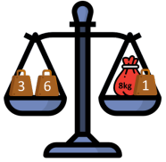

# Scales and Weights

## Introduction

The statement is not 100% precise, so: You want to put all the flour in one bag and weigh it, not splitting it into smaller bags for weighing. The weights to measure are whole numbers only.

## Solution   

This problem has two different versions depending on the assumptions you're using. Both are interesting,
and it is worth **encouraging students to try both.**   

- The first version is probably slightly easier, and assumes that you can only put weighing stones on the side of the scale.   

- In the second version, you can put weighing stones on either side, giving more options.   

**Encourage students to try for much smaller numbers than 40 first.** For example, if we only want to measure weights up to 7kg, then weighing stones of 1 kg and 2 kg and 4kg are sufficient (check that you can measure 1,2,3,4,5,6,7kg with these!).   

If we could put weights on both sides we could come up with more interesting solutions, for example if we had 1kg, 3kg and 6kg weights we could weight 1,2,3,4,5,6,7,8,9, and 10!   

E.g. If we have 8kg of flour, we could add the 1kg weight to it and it would balance against the 6kg and 3kg. See if you can make all the other numbers!   

The best strategy for the first problem is to start from 1kg, and every time there is a number you can’t
make add another stone. Quickly you see that if you have **1kg, 2kg, 4kg, 8kg, 16kg,** you can measure every
number up to 31kg. You will therefore need a 5th stone to reach 40kg. You could make this a 9kg stone,
however it would be better if you added a **32kg** stone and now can measure everything up to 63kg.   

For the second problem you not only want to consider the total when stones are added together, but the difference when they are subtracted (because you can have stones on either side). You want to give as many different numbers as possible using as few stones as possible.   

To start we will either need a 1kg stone, or 2 stones with a 1kg difference. In the example above we started
with a 1kg stone but what if we started with **1kg** and **3kg**? We can now measure 1,2,3,4.To get 5kg we can pick the largest number which will balance against the 5kg flour + 1kg + 3kg stones, so we should pick **9kg**. This now lets us make every number up to 9+3+1 = 13kg. To get 14kg we simply add a **27kg** stone, because 27kg – 9kg – 3kg – 1kg = 14. With the 27kg stone we can now measure everything up to 40Kg, so **it is possible with only these 4 stones!**

## Extension

Continue this process to see which stones you would use up to 1000kg. Is there a formula you could use to
calculate?
