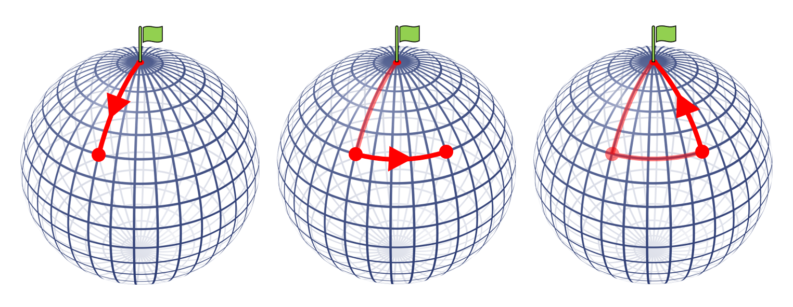
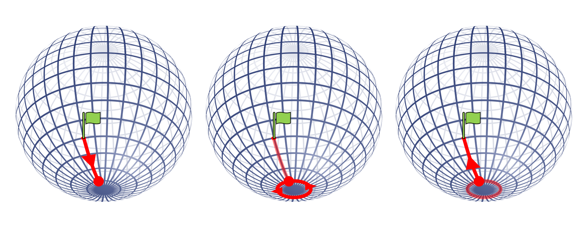
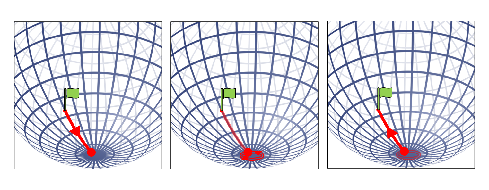

# Where on Earth?

## Introduction

The nice thing about this puzzle is that there are multiple answers which increase in obscurity. Usually students will find one particular answer first (or if they have heard the problem before, this is likely the solution that they will have seen), which is given in the Solution section. This solution is a great example of how geometry is different on flat and curved surfaces, specifically that the sum of the angles in a triangle on a sphere is more that 180 degrees.

In addition to this answer, there are others which are less obvious and students may need to be guided to find these solutions. These are given in the Extension section. They could be illustrated using a football or a balloon.

## Solution

The first solution that students will likely find is that you could begin your journey at the North Pole.

We can see why this situation works by thinking carefully about how moving either north/south or east/west works. When travelling north or south, we are moving towards or away from the north pole so our distance from the north pole changes. Whereas when travelling east or west, we move perpendicular to this and so the distnace from the north pole does not change.

So, starting at the north pole, travelling 1km south ends 1km away from the north pole.  
Moving 1km east does not change the distance away from the pole, leaving us still 1km away.  
Finally, travelling 1km north, towards the north pole, brings the journey back to its starting point.

It may be more obvious to see this with a diagram:

## Extension

There is another way that this journey could end at the same point that it started, which is if you begin travelling 1km north from the same place that you ended travelling 1km south. This would mean that travelling 1km east has not changed your position, so where is this the case?

As mentioned in the Solution section, when you travel east you are not changing your distance from either of the poles. So you are following part of a circular path which is parallel to the equator. As this cirlce gets closer to either of the poles it gets smaller, so there must be a particular circle which has a circumference of 1km. In fact there are two of these circles, one near to the north pole and one near to the south pole. Starting at any point on either of these circles and walking 1km east will bring you back to the point at which you started.

So if the whole journey begins 1km north of any point on these circles...  
We will first travel 1km south, ending on the circle.  
We will then travel 1km east, going all the way around the circle and ending back where we started this part of the journey.  
Finally, travelling 1km north will bring the journey to an end at the same point at which we started.

Let's illustrate this with a diagram:

You will notice that this diagram shows the journey using a circle near the south pole. But we said that there is also a circle with circumference 1km near the north pole. Unfortunately, however, the distance between either of these circles and their respective poles is less than 1km. So, it is impossible to walk 1km south and end up at the circle near the north pole; you would have to start at a point further north than the north pole!

For other solutions, consider how we chose a circle to have circumference 1km so that when we travelled 1km around it we ended at that same point that we started. Are there any other sized circles where this is the case? How about a circle with circumference of half a kilometer? With this case we would walk around the circle twice before ending where back we started. 

Here is a diagram:

But how about a circle with circumference a third, or a quater, or a fifth of a kilometer? These would also work as we would travel around the circle three, four or five times before ending back where we started. In fact, we can choose any circle around the south pole which has a circumference of an *integer fraction* of 1km (which just means $\frac{1}{n}$ where *n* is a whole number), and by starting the journey 1km north of any point on this circle we will end in the same position that we started.
