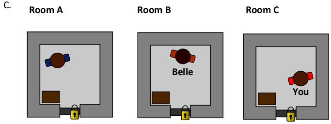
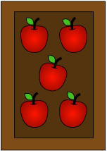

# Apple Teaser  

You and your two friends, Adam and Belle, are captured by an evil gang of apple thieves. In order to be released, the gang’s
leader, Ruben, sets you this fearsome challenge.  

Adam is locked in room A, Belle is locked in room B and you are locked in room

  

You each have a box of apples in your room. You can count the number of
apples in your own box, but not in anyone else’s.  

     • Each room has at least one apple  

     • No room has more than nine apples  

     • Each room has a different number of apples  

The rules of the challenge are: The three of you will get to ask Ruben one question, which he will answer truthfully with *“Yes”*or *“No”*. Everyone hears the questions and the answers. Ruben will release you if **one of you** tells him the total number of apples in the three rooms.  

*Adam: “Is the total number of apples an even number?”*

*Ruben: “No”*  

*Belle: “Is the total number of apples a prime number?”*  

*Ruben: “No”*  

You count five apples in your box.  **What question will you ask?**    

  

