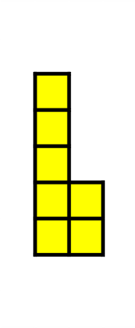
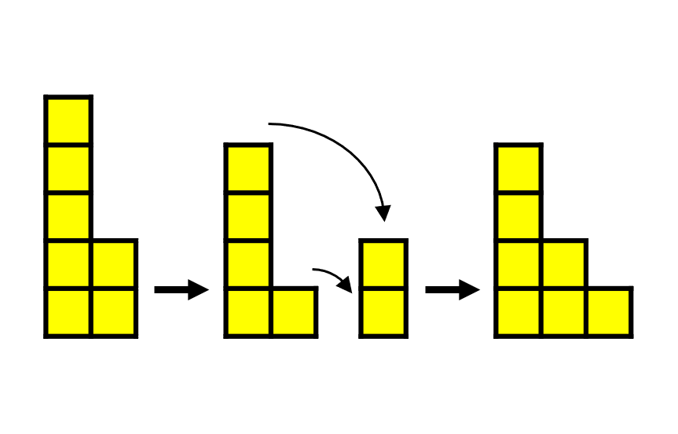
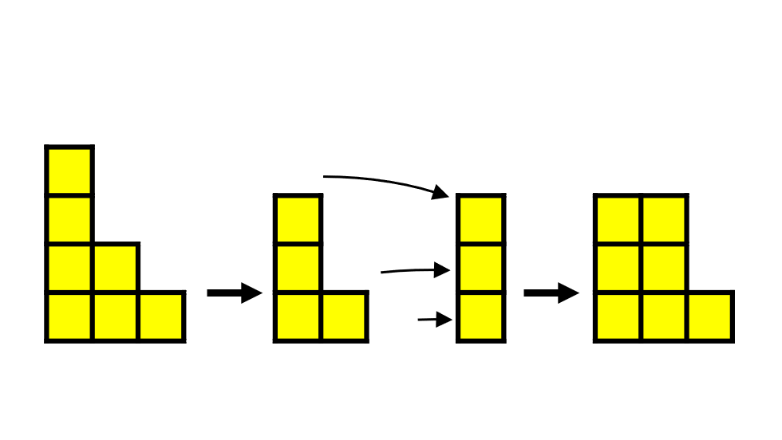
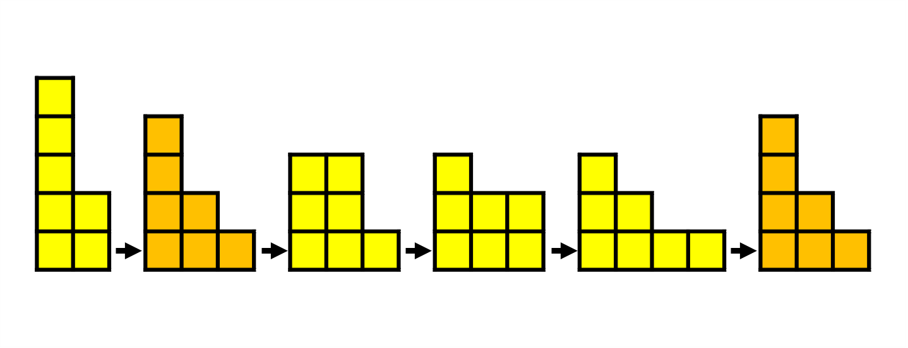

# Bulgarian Solitaire

This question is about a game called bulgarian solitaire. We will demonstrate the game here using blocks, but you could use playing cards, coins or anything that you can form into piles.

Start the game by taking a certain number of blocks and arranging them into piles, ordered by height from left to right.  
For example, you can play with 7 blocks and start by creating two stacks of 5 and 2:

To play the game, you need to rearrange the blocks in a certain way.  
Firstly, remove one block from the top of each existing pile and use these to form a new one.  
Then rearrange the new piles to be in height order from left to right.

Now you should repeat this process.

And continue repeating this process until you produce an arrangement that you have seen previously. At this point, you should stop.  
In our example, the sixth arrangement produced is that same as the second.

In this example, the entire sequence produces 5 different arrangements of blocks.  
You should try starting with different arrangements of 7 blocks, what is the longest sequence of different arrangements that you can find?

Do you notice any patterns or similarities between different starting arrangements of 7 blocks? In particular, look at how the sequences end.

As an extention, try using different numbers of blocks. What are the longest sequences that you can create and can you spot a pattern for how the sequences end?

Try using 5 or 6 squares. These will have fewer possibilities for starting cities.  
Try using 8, 9 or 10 squares. You will probably not want to consider every starting city for these (since there are a lot), but you may be able to spot some patterns particularly with regards to how the sequences end.

