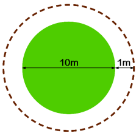
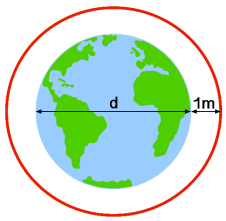

# Circumference
1. A farmer has a circular field
which is 10m wide. It has a
fence around it to stop his
chickens from escaping. If the
farmer wanted to extend his field by 1m in all directions, how much more fencing would he need?

    

2. Imagine a piece of rope is
tied around the equator of the
earth. How much longer does
the rope have to be if we
instead wanted the rope to be
1 metre **above** the earth **at all points**? (The diameter of the earth is d)  

      
    
    What do you notice about the two lengths?

