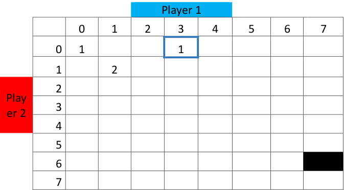

# Coin Game

In pairs play the following game a couple of times, and then answer the questions below.

One person is heads (player 1), the other person is tails (player 2).

Toss the coin a maximum of 10 times, player 1 gets a point if the coin lands on heads, and player 2 gets a point if the coin lands on tails. If one person becomes three points ahead of the other the game stops and they win. If no one is 3 points ahead after ten tosses the game is a tie.

Which of the following scores are impossible in this game and why?  
5-2, 7-4, 6-2

Think of ways the game could end in a tie.

What is the chance of winning this game?  
(use the table over the page to help)

Fill in the table shading out impossible final scores, highlighting winning final scores for Player 1 and Player 2, and highlighting final scores which indicate a draw.

Then write in each box how many ways there are to end up at each score.

A few boxes have been done for you – for example
3-0 is a winning score for player 1, and there is only 1 way to get to that score (1-0 then 2-0 then 3-0).

There are two ways to get to a score of 1-1 (0-1 then 1-1 or 1-0 then 1-1). There is a 1 in the 0-0 box as there is just one way to start the game

Now to calculate the probability of winning we can use these two rules

    • For a probability set of distinct events you add the individual probabilities

    • For the probability of 2 independent events happening in turn you multiply probabilities together
