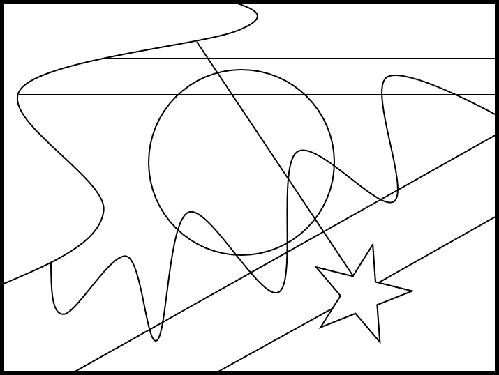

# Colouring Maps

Start by drawing an empty square:

Create a *map* by dividing the square into seperate regions. For example:

Now colour in your map such that there are no regions of the same colour which share an edge.

So here are two versions of a map which are both coloured correctly:

However, this would not be a correct way to colour this map:

If you do not have access to different colours, you could use shade different regions using different patters such as stripes, spots or squares.

Try to find the smallest number of different colours which you need to be able to do this.

What about other maps, can you find a certain number of colours which are able to colour in any map?
