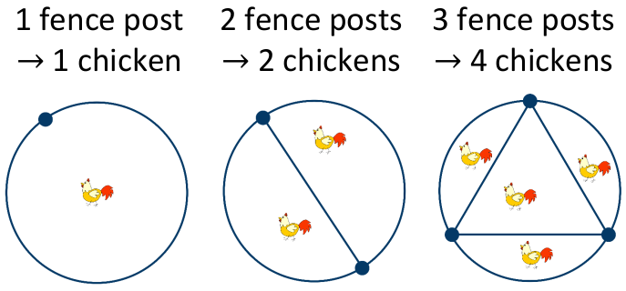

# Counting Chickens
A farmer keeps his chickens in circular fields,separated by fence posts and straight fencing.   

    

Can you work out how many chickens the
farmer can keep if he has:   

1\) &nbsp;&nbsp;&nbsp;&nbsp;4 fence posts   

2\) &nbsp;&nbsp;&nbsp;&nbsp;5 fence posts   

3\) &nbsp;&nbsp;&nbsp;&nbsp;6 fence posts

