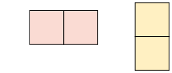
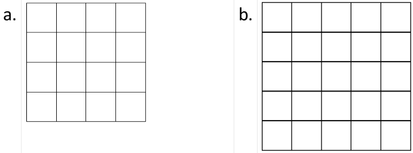
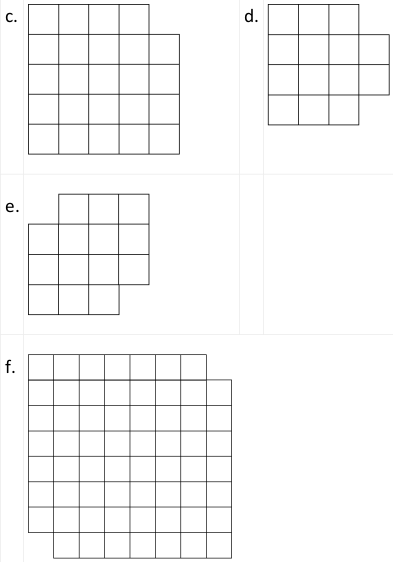

# Domino Tilings

Tile (cover) the following arrangements of squares with 2x1 dominos like these:

  

Aim for tilings with no overlap between the dominos, and with no square left out.  

Can you tile the shapes? If you cannot, why not? Can you find some further shapes that can, and that cannot, be tiled?  

    

    

