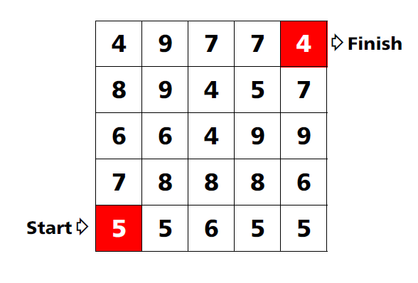

# Find the path

By moving up, down, left or right, make a path from the Start to the Finish.

Add up all the numbers you pass through.

Can you make exactly 53?

What is the smallest possible number?

Can you make exactly 60?
