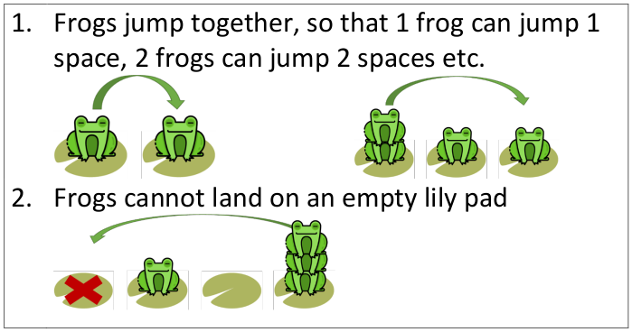

# Frog Party

5 frogs want to have a party. To do this they must all be on the same lily pad.

   

Frogs can jump left and right however there are a couple of rules:   

   

Can you find a way to move the frogs so they can have a party together on the same lily pad?   

Is it possible to have a party on every lily pad?

