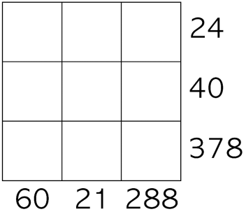

# Gabriel's Problem  

Gabriel wrote the numbers 1-9 in a 3x3 grid.
He then multiplied together all the numbers
in each row and wrote the resulting product
next to that row.  

 He also multiplied the
numbers in each column together and wrote
the product under that column.  

He then rubbed out the number 1-9.  

  

Can you work out where Gabriel originally
wrote the numbers 1-9? Did you have more
information that you needed?

