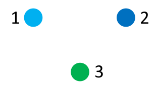
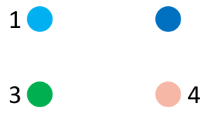

# Handshake Puzzles

Stage 1) If you have two people at a party
and each person shakes hands with every
person once, how many handshakes happen? 

Stage 2) If you have three people at a party and each person shakes hands with every person once, how many handshakes happen?  

  

Stage 3) If you have four people at a party and each person shakes hands with every person once, how many handshakes happen?

