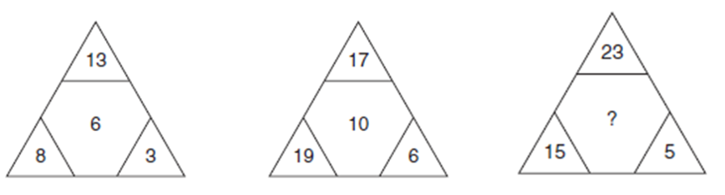
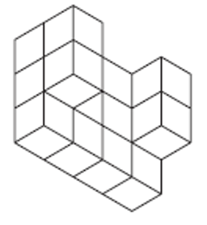

# IQ Challenge 1

1.Fill in the missing numbers for each sequence

0, 1, 4, 9, 16, 25, 36, 49, ?

0, 100, 6, 94, 12, 88, 18, 82, ?, ?

1.5, 3, 5.5, 9, 13.5, ?

5, 26, 131, 656, ?

2.What number should represent the ?

3.How many faces are visible on the shape below if you could look at it from all directions?

