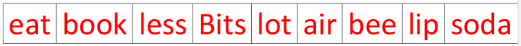
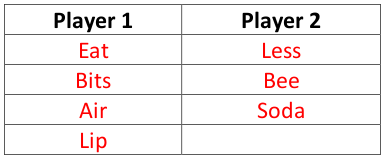
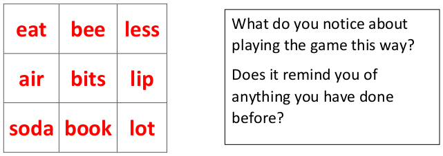

# Letter Matching

**Only play this game after you have played Tic-tac-toe!**  

Write the following words in your book or on paper:

This is a 2 player game. Take it in turn to pick one word from the list.   

The winner is the first person to have exactly three words that contain
the same letter.   

**Example**    

Player 1 has won because bits, air and lip all contain the letter i.   

After playing many times now write the numbers in a square like this and play the same game again.   

