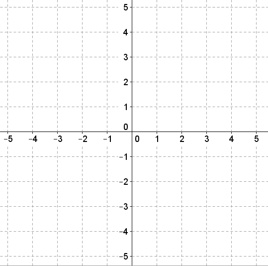

# Making Squares

This is a game for 2 players (or 2 teams)  
Take it in turns to plot a point on the coordinate grid for your team.  

The first team to make a square using 4 of their points wins.
