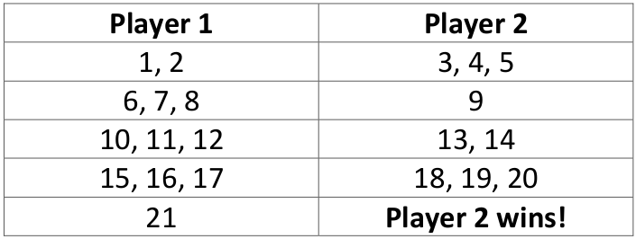

# Nim/21

Rules
   
Two player game.   

One person starts counting from 1 and can stop at 1, 2 or 3.   

The next player carries on counting from where the first player stopped and can say up to 3 more numbers.   

The player who says 21 is the **loser.**

**Example game:**

