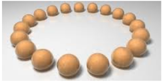

# Nim Related Games

**NIM**

Standard NIM is played with three piles of any number of objects (use coins, toothpicks, matchsticks, bottlecaps, whatever). Players take turns choosing **one** pile and removing any number of coins away from that pile. The person who takes the last object loses.

**Subtraction NIM**

You can take a maximum of k objects from a pile on each turn, where k is established by the players in advance. The person who takes the last object loses.

**Circular NIM**

Place a number of objects in a circle. You can remove up to 3 adjacent objects on a turn. The person who takes the last object loses.

