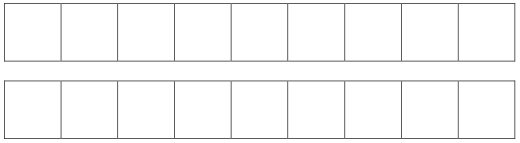
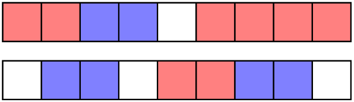

# Paper Pieces

Two player game, played on two rows of squares
(any length)

Players take turns to colour in **any two adjacent** squares. The first player who can’t make such a move is the **loser.**

Example: After Red's 4 th turn, Blue cannot make another move and loses.

**Variation:** Play the game with just one row of
squares.
