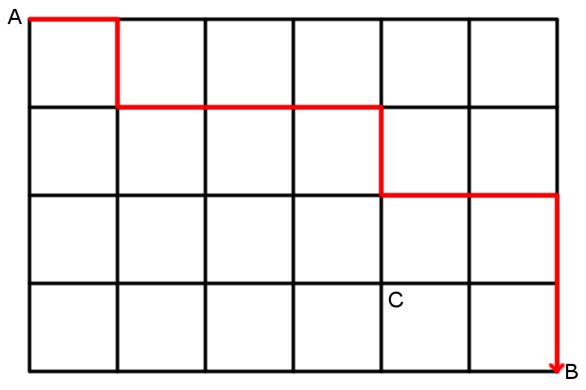

# Paths

1.How many ways are there from A to B in the grid if you can only walk along the lines and only walk right or down each time? How about from A to C? How about from A to any other point?

2.How can you write down a path from A to B as a sequence of 10 letters? Or as a set of 4 numbers?

Only try these after solving 1 and 2:

3.How many ways are there to line up 4 blue and 6 green books in your shelf?

4.If you take 3 balls from a bag of 7 different balls, how many possible different outcomes are there?