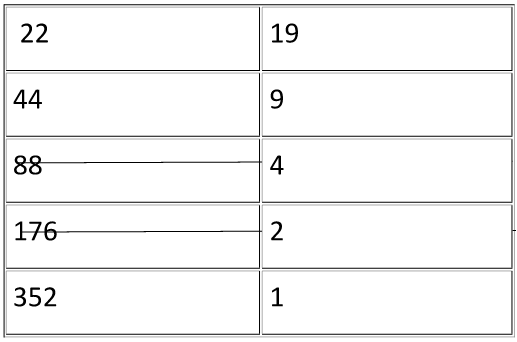

# Russian Multiplication

Multiply together 22 and 19, writing down your answer.  

 Then read the following instructions.   

Write 22 on the left and 19 on the right. Multiply the left side by 2 every time and divide the right side by 2, and do this until the right side is equal to 1. If, while you do this, you ever get a decimal number on the right side, round down to the next integer.  

  

The next step is to get rid of all the lines with an even number on the right side, which leaves us with 22, 44 and 352 on the left side. What do you notice when you add 22, 44 and 352? Now try this with other multiplications.   
Does it still work? If it does, can you explain why it works?

