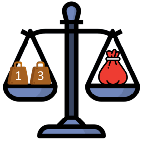

# Scales and Weights

You have a shop selling maize flour by weight.
Your customers may want to buy any amount
between 1 and 40 kg of flour.   

   

You also have a balancing scale and want to
buy weighing stones to use with it.   

   

Which weighing stones should you buy so you
can measure any weight between 1 and 40
kg? (You want to buy as few as possible)

