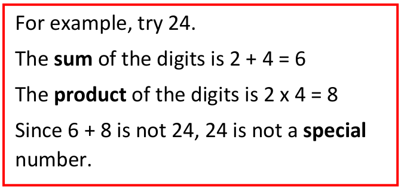

# Special Numbers 

Can you guess my special two digit number?   

My number is special because if I add the **sum** of its digits to the **product** of its digits, it gives my original number!   

What could my number be?

   

&nbsp;&nbsp;&nbsp;&nbsp;&nbsp;&nbsp;&nbsp;&nbsp;&nbsp;1.&nbsp;&nbsp;&nbsp;&nbsp;&nbsp;&nbsp; Can you find a special number?
   
&nbsp;&nbsp;&nbsp;&nbsp;&nbsp;&nbsp;&nbsp;&nbsp;&nbsp;2.&nbsp;&nbsp;&nbsp;&nbsp;&nbsp;&nbsp;   Can you find more than one?   

&nbsp;&nbsp;&nbsp;&nbsp;&nbsp;&nbsp;&nbsp;&nbsp;&nbsp;3.&nbsp;&nbsp;&nbsp;&nbsp;&nbsp;&nbsp;  Can you find them all?

