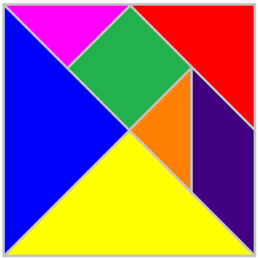

# Tangrams

**You will need pen, paper and either scissors or a ruler for this game**   

Create a tangram by tracing the image below onto a square of paper, or try to construct using paper folding   

Cut into individual pieces and see what shapes you can make   

Can you make the square again? How about any animals? Or letters in the alphabet?