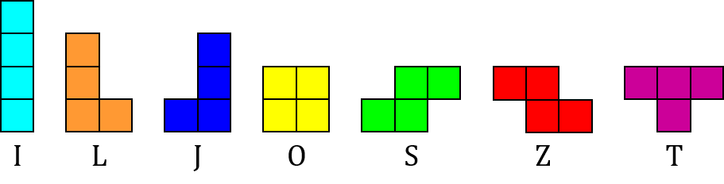
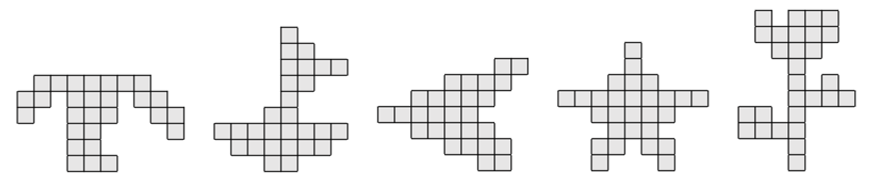

# Tetris Shapes

Using these seven blocks (from the arcade game *Tetris*), can you create the shapes at the bottom of this page?

You are allowed to rotate the blocks but not to reflect them, so you cannot change the 'L-block' into a 'J-block' by flipping it over.

Four of these five shapes can be created using exactly one of each block.  
(left to right: Tree, Boat, Spaceship, Star, Flower)

Can you spot which one is not possible?

What other shapes can you make using these blocks?
