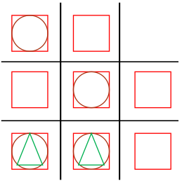

# Tic Tac Toe With levels

Draw the grid shown to make a grid with 9
spaces.

This is a 2 player game.

Take it in turns to either:

    • draw a square in an empty space

    • draw a circle inside a square

    • draw a triangle inside a circle

The winner is the first person to complete a line of 3 spaces with the same symbol.

**Example**

In this game, the next player can win by putting a circle in the bottom right to make a diagonal line.

(It doesn't matter who draw the other symbols, only who completes it.)
