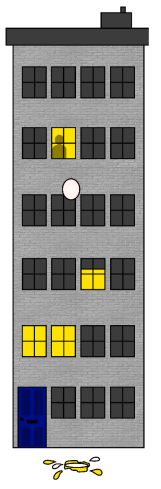

# Two Eggs

You are given **two eggs** and access to a 100-storey building.   

If an egg is dropped and does not break, it can be dropped again. Once the egg breaks, it cannot be used again. If an egg breaks when dropped from floor n, then it would also have broken from any floor above that. If an egg survives a fall,then it will survive any fall shorter than that.   

How would you find out what the highest floor is from which an egg will **not** break when dropped out of the window? How would you minimise the number of egg drops it takes to find this out?   

