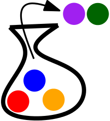

# Balls and Books

.1. You have a bag of 5 balls, all of different colors. You take two balls out of the bag.

How many different possible outcomes are there? 

What if you add another ball of a new color to the bag (so you have 6)? What about 7 balls?

Is there a similar problem you've already solved?

.2. You have 2 blue books and 3 green books. The blue books all look the same and the green books all look the same.

How many ways are there to line them up in the shelf?

What if there are 4 green books? 5 green books?
